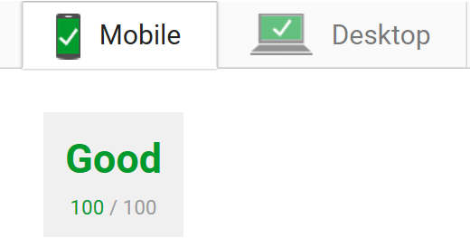

# ASP.NET Core Template Pack

[](https://ci.appveyor.com/project/madskristensen/aspnetcoretemplatepack)

Contains various project templates for ASP.NET Core development.

## Install

### Command line
In the console, execute the following command:

```
dotnet new -i "AspNetCore.Web.Templates::*"
```

### Visual Studio 2017.3
The extension adds the project template to the ASP.NET New Project dialog:


## Templates

### Static Website
Uses the ASP.NET Core project system to provide the latest features in Visual Studio web tooling to create a completely static website. No C# in the project at all - just plain old CSS, JavaScript and HTML.


## Custom MimeType mappings
See the [Static Site Helper repo](https://github.com/madskristensen/AspNetCore.StaticSiteHelper) for how to serve custom file extensions at development time through ASP.NET Core.

#### Use

```
dotnet new staticweb -n myapp
```

### MVC Basic
This template makes it super easy to get started with building an ASP.NET Core MVC application. It doesn't have any dependencies on Bower, npm, BundlerMinifier, Bootstrap, jQuery or anything else. It's the perfect starting point for developers that know their ASP.NET Core.


#### Use

```
dotnet new mvcbasic -n myapp
```

### MVC Fast
This template is a variation of the "MVC Basic" template, but with added features for creating high performance web applications.

Features:

- Using Gulp to bundle and minify CSS and JS files
- Minifies the HTML
- Uses response caching on both client and server
- Inline CSS for *above the fold* content
- Cache busting of CSS and JS references


The template points starts you out with the best score on [webspeedtest.org](http://webspeedtest.org).


As well as 100/100 points on [PageSpeed Insights](https://developers.google.com/speed/pagespeed/insights/)



#### Use

```
dotnet new mvcfast -n myapp
npm install
```